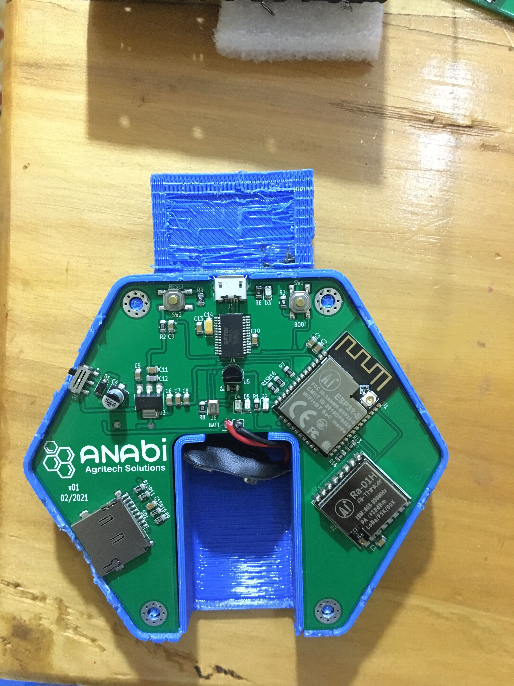
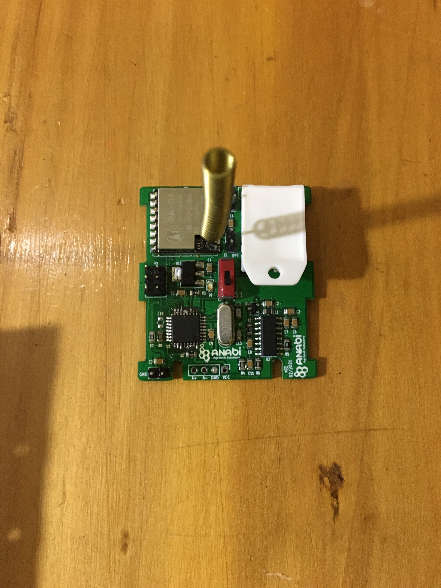
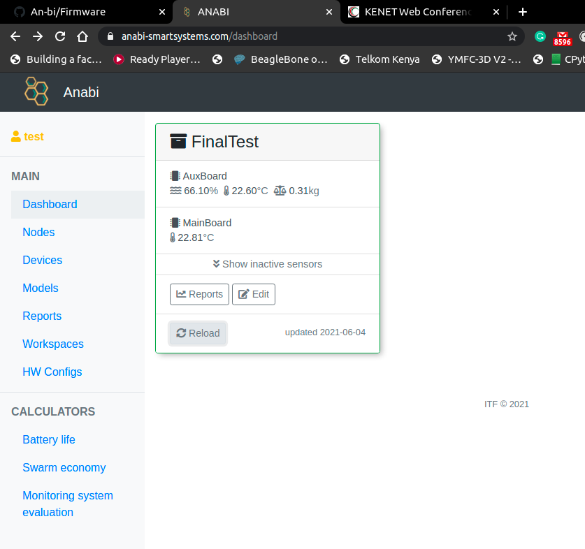
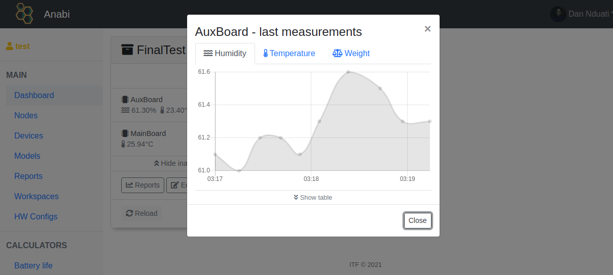
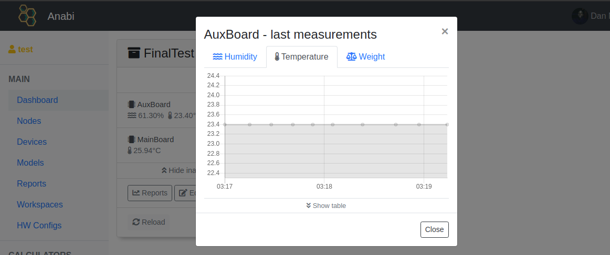
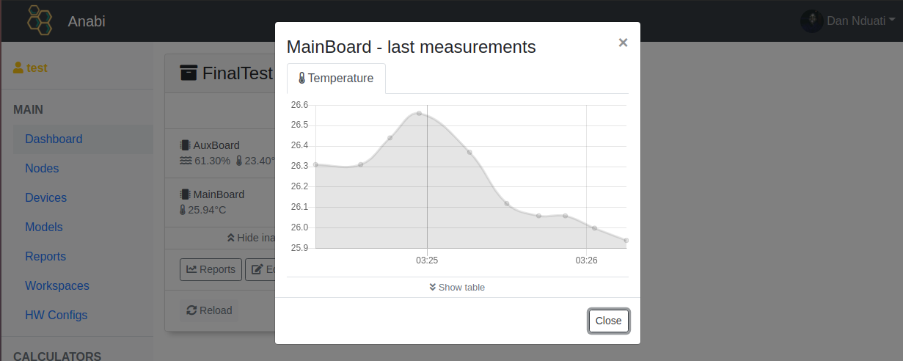
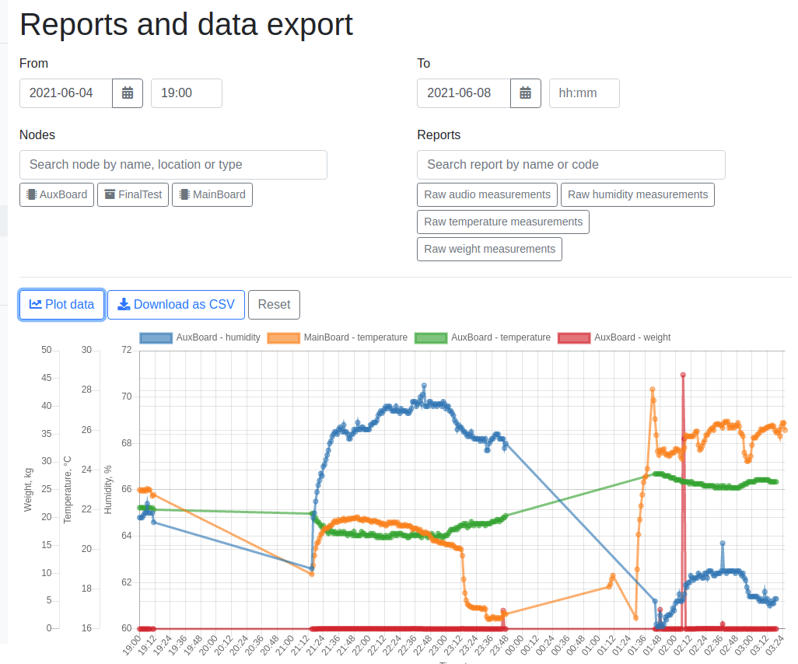

# Bee Keeping Firmware
## Hardware components
### 1.Main controller -> ESP32

	</img>
	</img>

- Measure temperature using the onboard ds18b20 sensor
- samples hive 'noise' via i2s using the microphone on the board  
- receive hive weight, ambient temperature and humidity data from aux board via LoRa 
- post the temperature, audio and the aux sensor data to anabi DW server
- logging sensor payload data on post data errors

### 2.Auxilliary board -> atmega328p 

	</img>
	</img>

- measures weight of the hive with load cells
- measure ambient temperature and humidity using the dht22 
- send data to main board via loRa

## Folder structure
	.
	├── firmware			# Firmware files
			├── c			# C/arduino version of the firmware
			├── micropython	# micropython version of the firmware
			├── libraries	# Libraries used in the firmware
	├── pythonTests			# Api python tests
	├── images              # Image files
	└── README.md

## WebApi
WebApi component provides an access to DW for external systems and components via REST
API. 

	</img>
	</img>
	</img>
	</img>
	</img>

